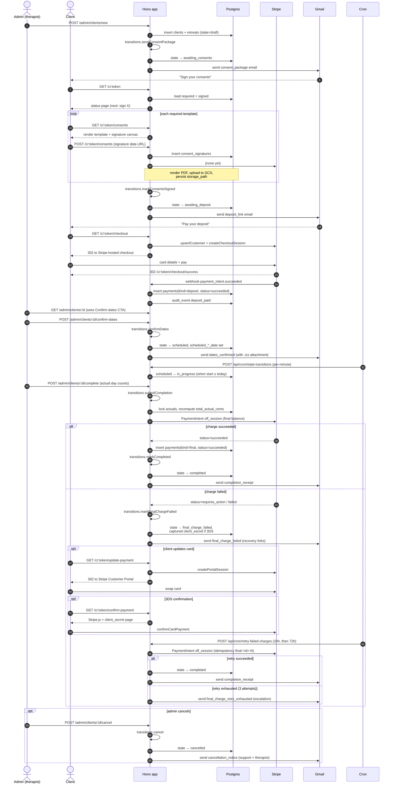

# Client journey — end-to-end sequence

Covers the happy path plus failure-recovery branches. State labels match
`lib/state-machine.ts`. URLs prefixed with `/c/<token>` are token-gated
public surfaces; `/admin/*` are session-gated.

## State summary

| State | Entry | Next | Notes |
|-------|-------|------|-------|
| `draft` | client+retreat insert | `awaiting_consents` | sendConsentPackage |
| `awaiting_consents` | consent email sent | `awaiting_deposit` | markConsentsSigned (last sig) |
| `awaiting_deposit` | consents complete | `scheduled` | deposit_paid + confirmDates |
| `scheduled` | confirmDates | `in_progress` | cron, when start ≤ today |
| `in_progress` | start date reached | `completed` / `final_charge_failed` | submitCompletion |
| `completed` | final charge succeeded | (terminal) | receipt sent |
| `final_charge_failed` | final charge failed | `completed` / (exhausted) | retry cron 24h then 72h |
| `cancelled` | admin cancel | (terminal) | cancel allowed pre-completion |

## Where to view live

Production base: `https://clients.intensivetherapyretreat.com`  
Dev base: `https://itr-client-hq-buejbopu5q-uc.a.run.app`

To open any `/c/:token` page in the browser, copy the **Public client URL**
shown on `/admin/clients/<retreatId>` after signing in.
